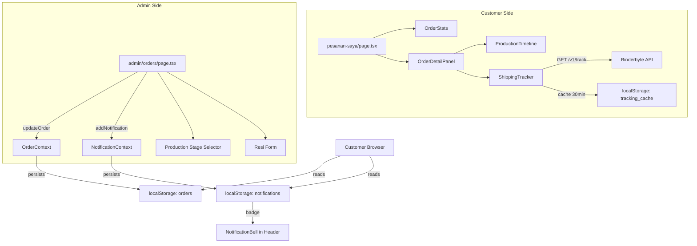

# Design Document: Order Management Revamp

## Overview

Revamp ini mengganti sistem manajemen pesanan yang sederhana (status dropdown tunggal + panel detail minimal) dengan dua lapisan pelacakan: **Production Timeline** (dikelola admin, fase 1) dan **Shipping Tracker** (otomatis via Binderbyte API, fase 2). Semua state tetap disimpan di localStorage melalui React Context — tidak ada backend baru yang diintroduksi.

Perubahan inti:
1. Ekstensi tipe `Order` dengan field produksi, pengiriman, dan pembayaran baru (semua opsional)
2. Halaman Pesanan Saya: tambah kartu statistik + refactor panel detail ke komponen terpisah
3. Halaman Admin Pesanan: ganti dropdown status dengan pemilih tahap produksi + form input resi
4. Komponen baru: `ProductionTimeline`, `ShippingTracker`, `OrderDetailPanel`, `OrderStats`
5. Pembaruan `UserProfilePopup`: hapus menu Riwayat Transaksi
6. Notifikasi otomatis untuk setiap perubahan status kritis

**Ringkasan temuan research — Binderbyte API:**
Binderbyte (`api.binderbyte.com`) adalah layanan API tracking resi Indonesia yang mendukung kurir J&T, JNE, SiCepat, AnterAja, dan Pos Indonesia. Berdasarkan dokumentasi resmi di [docs.binderbyte.com](http://docs.binderbyte.com/api/cek-resi) dan [Postman collection](https://documenter.getpostman.com/view/12963788/TVRg69g4), endpoint tracking menggunakan:

- **Method:** `GET`
- **URL:** `https://api.binderbyte.com/v1/track`
- **Query params:** `api_key` (dari env var), `courier` (slug kurir, lowercase), `awb` (nomor resi)
- **Response sukses (200):**
  ```json
  {
    "code": "200",
    "messages": "Success",
    "data": {
      "summary": {
        "courier_name": "J&T Express",
        "awb": "JP123456789",
        "status": "DELIVERED",
        "date": "2024-01-15 14:00:00",
        "desc": "Paket telah diterima"
      },
      "history": [
        {
          "date": "2024-01-15 14:00:00",
          "desc": "Paket telah diterima oleh [nama penerima]",
          "location": "Jakarta Selatan"
        }
      ]
    }
  }
  ```
- **Courier slug mapping:** `jnt`, `jne`, `sicepat`, `anteraja`, `pos`
- **Error response:** `code` bukan "200", field `messages` berisi deskripsi error
- **Caching strategy:** Hasil tracking di-cache ke localStorage dengan TTL 30 menit untuk menghindari hit berulang (Binderbyte berbayar per request)

---

## Architecture

### Data Flow Diagram



### Komponen Hierarki

```
app/pesanan-saya/page.tsx            (refactored)
  └── components/order/order-stats.tsx      (NEW)
  └── components/order/order-detail-panel.tsx  (NEW)
        └── components/order/production-timeline.tsx  (NEW)
        └── components/order/shipping-tracker.tsx     (NEW)

app/admin/orders/page.tsx            (refactored)
  ├── Production Stage Selector (inline, no new file)
  └── Resi Input Form (inline, no new file)

components/user-profile-popup.tsx    (modified)
lib/types.ts                          (modified)
lib/contexts/order-context.tsx        (no change needed)
lib/contexts/notification-context.tsx (new helper functions added)
```

### State Management

Semua state menggunakan pola yang sudah ada: React Context + localStorage. Tidak ada tambahan library state management.

```
localStorage keys:
  "orders"           → Order[]  (existing, schema extended)
  "safa_notifications" → AppNotification[]  (existing)
  "tracking_{awb}"   → TrackingCache  (NEW — per nomor resi)
```

---

## Components and Interfaces

### `OrderStats` (`components/order/order-stats.tsx`)

Menampilkan 6 kartu statistik di bagian atas halaman Pesanan Saya.

```typescript
interface OrderStatsProps {
  orders: Order[]           // pesanan milik user yang sedang login
  activeFilter: string      // status tab yang aktif saat ini
  onFilterChange: (status: string) => void
}
```

Setiap kartu menampilkan: ikon, label status, jumlah pesanan. Klik kartu → `onFilterChange(status)`.

Kategori kartu:
| key | Label | Status yang dihitung |
|-----|-------|---------------------|
| `all` | Total Pesanan | semua |
| `pending` | Menunggu Pembayaran | `pending` |
| `processing` | Diproses | `processing` |
| `shipped` | Dikirim | `shipped` |
| `delivered` | Selesai | `delivered` |
| `cancelled` | Dibatalkan | `cancelled` |

### `ProductionTimeline` (`components/order/production-timeline.tsx`)

Menampilkan progress produksi 6-tahap dalam layout vertikal.

```typescript
interface ProductionTimelineProps {
  productionStage?: ProductionStage  // undefined → semua inactive
}
```

Urutan tahap dan label:
```
menunggu_pembayaran  → "Menunggu Pembayaran"
pembayaran_diterima  → "Pembayaran Diterima"
desain_direview      → "Desain Direview"
produksi             → "Produksi"
quality_control      → "Quality Control"
siap_dikirim         → "Siap Dikirim"
```

Logika visual: tahap yang index-nya ≤ index tahap saat ini → aktif (✓, warna primary). Selebihnya → muted.

### `ShippingTracker` (`components/order/shipping-tracker.tsx`)

Mengambil dan menampilkan data tracking dari Binderbyte API.

```typescript
interface ShippingTrackerProps {
  courier: ShippingCourier   // 'J&T' | 'JNE' | 'SiCepat' | 'AnterAja' | 'Pos Indonesia'
  resi: string
  orderId: string            // untuk update status delivered
  userId: string             // untuk trigger notifikasi
  orderNumber: string        // untuk pesan notifikasi
  currentStatus: string      // mencegah duplikasi notifikasi delivered
}
```

Internal state: `'idle' | 'loading' | 'success' | 'error'`.

**Courier slug mapping** (untuk query param Binderbyte):
```typescript
const COURIER_SLUG: Record<ShippingCourier, string> = {
  'J&T':           'jnt',
  'JNE':           'jne',
  'SiCepat':       'sicepat',
  'AnterAja':      'anteraja',
  'Pos Indonesia': 'pos',
}
```

### `OrderDetailPanel` (`components/order/order-detail-panel.tsx`)

Panel detail lengkap untuk satu pesanan. Ditampilkan secara inline (expand-in-place) di halaman Pesanan Saya.

```typescript
interface OrderDetailPanelProps {
  order: Order
  onClose: () => void
}
```

Seksi yang ditampilkan (berurutan):
1. Header (nomor pesanan, tanggal, badge status, badge payment)
2. Informasi Produk (tabel item dengan design preview jika ada)
3. Production Timeline (`<ProductionTimeline>`)
4. Shipping Tracker (hanya jika `order.shippingResi && order.shippingCourier`)
5. Alamat Pengiriman
6. Informasi Pembayaran (metode, status, tanggal)
7. Ringkasan Harga (subtotal, ongkir, total)

---

## Data Models

### Ekstensi `Order` di `lib/types.ts`

Field baru yang ditambahkan ke interface `Order` yang sudah ada (semua opsional):

```typescript
// Tambahkan ke interface Order yang sudah ada:
export type ProductionStage =
  | 'menunggu_pembayaran'
  | 'pembayaran_diterima'
  | 'desain_direview'
  | 'produksi'
  | 'quality_control'
  | 'siap_dikirim'

export type ShippingCourier = 'J&T' | 'JNE' | 'SiCepat' | 'AnterAja' | 'Pos Indonesia'

// Ditambahkan ke interface Order:
//   productionStage?:     ProductionStage
//   productionUpdatedAt?: string          // ISO date string
//   shippingCourier?:     ShippingCourier
//   shippingResi?:        string
//   paymentMethod?:       string
//   paymentDate?:         string          // ISO date string
```

Interface `Order` lengkap setelah ekstensi:

```typescript
export interface Order {
  id: string
  orderNumber: string
  userId: string
  items: OrderItem[]
  total: number
  status: 'pending' | 'processing' | 'ready' | 'shipped' | 'delivered' | 'cancelled'
  paymentStatus: 'pending' | 'paid' | 'failed'
  shippingAddress: Address
  createdAt: Date
  updatedAt: Date
  notes?: string
  // --- NEW fields (all optional for backward compatibility) ---
  productionStage?:     ProductionStage
  productionUpdatedAt?: string
  shippingCourier?:     ShippingCourier
  shippingResi?:        string
  paymentMethod?:       string
  paymentDate?:         string
}
```

### Model Cache Tracking (localStorage)

```typescript
interface TrackingCache {
  cachedAt: string        // ISO timestamp
  data: BinderbyteTrackResponse
}
```

Key format: `tracking_{awb}` (contoh: `tracking_JP123456789`)

### Model Respons Binderbyte API

```typescript
interface BinderbyteTrackResponse {
  code: string
  messages: string
  data?: {
    summary: {
      courier_name: string
      awb: string
      status: string
      date: string
      desc: string
    }
    history: Array<{
      date: string
      desc: string
      location: string
    }>
  }
}
```

### Notification Helpers Baru di `notification-context.tsx`

Tambahkan fungsi helper berikut ke `lib/contexts/notification-context.tsx`:

```typescript
export function buildProductionStageNotif(
  userId: string,
  orderNumber: string,
  orderId: string,
  stage: ProductionStage
): Omit<AppNotification, 'id' | 'createdAt' | 'isRead'>

export function buildResiNotif(
  userId: string,
  orderNumber: string,
  orderId: string,
  courier: string,
  resi: string
): Omit<AppNotification, 'id' | 'createdAt' | 'isRead'>

export function buildDeliveredNotif(
  userId: string,
  orderNumber: string,
  orderId: string
): Omit<AppNotification, 'id' | 'createdAt' | 'isRead'>
```

**Mapping stage → notifikasi:**

| Stage | Title | Trigger notif? |
|-------|-------|---------------|
| `pembayaran_diterima` | 💳 Pembayaran Diterima | ✅ |
| `produksi` | ⚙️ Produksi Dimulai | ✅ |
| `quality_control` | 🔍 Quality Control | ✅ |
| lainnya | — | ❌ |

---

## Correctness Properties

*A property is a characteristic or behavior that should hold true across all valid executions of a system — essentially, a formal statement about what the system should do. Properties serve as the bridge between human-readable specifications and machine-verifiable correctness guarantees.*

**Property Reflection:** After analyzing all 40+ acceptance criteria, redundant properties were consolidated. Properties 3.3 (zero counts) is subsumed by 3.2 (general count correctness); properties 6.3/6.4 (inactive stages, labels) are subsumed by the general stage ordering property; properties 8.6/8.7 (status change and notification) are part of the same atomic action as 8.5; properties 9.3/9.4 (specific stage side-effects) are unified into the general stage side-effects property; notification properties 10.1–10.5 are unified into one payload-correctness property.

---

### Property 1: Stats count consistency and user scoping

*For any* list of orders with mixed `userId` values, the `OrderStats` count computation scoped to a specific user SHALL satisfy: (a) every category count reflects only that user's orders, (b) the sum of all per-status counts equals the total count, and (c) every order by that user is counted in exactly one category.

**Validates: Requirements 3.2, 3.3, 3.5**

---

### Property 2: Stats filter completeness

*For any* set of orders and any status value (including `'all'`), filtering orders by that status SHALL return exactly the orders whose `status` field matches — no more, no fewer. Filtering by `'all'` SHALL return every order.

**Validates: Requirements 3.4**

---

### Property 3: Order list rendering completeness

*For any* `Order` object in the list, the rendered order row SHALL include the order number, all product names (comma-separated for multi-item orders), total price, status badge, and creation date.

**Validates: Requirements 4.1, 4.2**

---

### Property 4: Order list sort ordering

*For any* unsorted list of orders with distinct `createdAt` timestamps, after the sort applied on the Pesanan Saya page, the resulting list SHALL be in non-increasing `createdAt` order (newest first).

**Validates: Requirements 4.3**

---

### Property 5: Production timeline stage ordering

*For any* `ProductionStage` value (including `undefined`), the `ProductionTimeline` component SHALL render exactly the stages with index ≤ the current stage's index as active (✓), and all stages with higher index as inactive — with no gaps, no inversions, and no runtime errors. When `productionStage` is `undefined`, all stages SHALL be inactive.

**Validates: Requirements 6.2, 6.3, 6.5, 11.3**

---

### Property 6: Tracking cache freshness decision

*For any* cached tracking result with a known `cachedAt` timestamp, the `ShippingTracker` cache resolution logic SHALL use the cached data without calling the API when the cache age is ≤ 1800 seconds (30 minutes), and SHALL trigger a new API call and overwrite the cache when the age is > 1800 seconds or the cache is absent.

**Validates: Requirements 7.6, 7.7**

---

### Property 7: Tracking history display ordering

*For any* Binderbyte API response containing a non-empty `data.history` array, `ShippingTracker` SHALL display every history entry and the entries SHALL appear in reverse-chronological order (most recent first).

**Validates: Requirements 7.3**

---

### Property 8: Tracking error safety

*For any* error response from Binderbyte API (any `code` value other than `"200"`, or a network failure), `ShippingTracker` SHALL render an informative error message and SHALL NOT throw an uncaught exception.

**Validates: Requirements 7.4**

---

### Property 9: Resi save atomic side-effects

*For any* order and any valid `(courier, resi)` pair, invoking the save-resi action SHALL atomically produce all of: `order.shippingCourier === courier`, `order.shippingResi === resi`, `order.status === 'shipped'`, and a customer notification with a title referencing the resi — none of these changes SHALL occur without the others.

**Validates: Requirements 8.5, 8.6, 8.7, 10.4, 10.5**

---

### Property 10: Resi save validation gate

*For any* invocation of the save-resi action where either `courier` or `resi` is an empty string, the action SHALL not modify the order state and SHALL not add any notification.

**Validates: Requirements 8.8**

---

### Property 11: Production stage side-effects correctness

*For any* `ProductionStage` value selected by admin, the update SHALL always set both `productionStage` and `productionUpdatedAt` on the order; specifically, selecting `'pembayaran_diterima'` SHALL also set `paymentStatus = 'paid'` and `paymentDate` to a non-null ISO timestamp; selecting `'siap_dikirim'` SHALL also set `status = 'ready'`.

**Validates: Requirements 9.2, 9.3, 9.4**

---

### Property 12: Notification payload correctness

*For any* `(userId, orderNumber, orderId)` triple, each `buildProductionStageNotif` call for a notifiable stage (`pembayaran_diterima`, `produksi`, `quality_control`) SHALL produce a payload where `userId` matches, the `message` contains `orderNumber`, and the `title` matches the stage's designated string exactly. The same SHALL hold for `buildResiNotif` (title includes "Resi", message includes courier name and resi number) and `buildDeliveredNotif`.

**Validates: Requirements 10.1, 10.2, 10.3, 10.4, 10.5, 10.6**

---

### Property 13: Backward compatibility — partial order objects

*For any* `Order` object missing any combination of the new optional fields (`productionStage`, `productionUpdatedAt`, `shippingCourier`, `shippingResi`, `paymentMethod`, `paymentDate`), both `OrderContext.addOrder` and `OrderContext.updateOrder` (with any partial update) SHALL complete without error, and `OrderContext.getOrderById` SHALL return the order with only the originally provided fields — no fields SHALL be silently added or mutated.

**Validates: Requirements 1.7, 11.1, 11.4**

---

## Error Handling

### Binderbyte API Errors

| Skenario | Penanganan |
|----------|-----------|
| Network error / timeout | Tampilkan pesan "Tidak dapat terhubung ke layanan pelacakan. Coba lagi nanti." + tombol retry |
| API mengembalikan `code !== "200"` | Tampilkan `messages` dari response sebagai pesan error user-friendly |
| `data.history` kosong | Tampilkan "Belum ada update pengiriman" |
| `NEXT_PUBLIC_BINDERBYTE_API_KEY` tidak di-set | `ShippingTracker` menampilkan warning development, tidak crash |

### Validasi Form Admin

| Skenario | Penanganan |
|----------|-----------|
| Simpan resi dengan kurir/resi kosong | Tampilkan inline validation message, tombol disabled hingga valid |
| Kurir dipilih tapi resi kosong (atau sebaliknya) | Validasi kedua field sebelum submit |

### Backward Compatibility

`OrderContext` sudah menggunakan spread operator (`{ ...order, ...updates }`), sehingga field baru yang `undefined` tidak akan overwrite nilai yang ada. Pesanan lama dari localStorage yang tidak memiliki field baru akan tetap dirender tanpa error karena semua field baru bersifat opsional.

---

## Testing Strategy

### Unit Tests (Example-Based)

Menggunakan **Jest + React Testing Library** (sudah tersedia di Next.js):

- `ProductionTimeline`: render dengan setiap nilai `productionStage`, render dengan `undefined`
- `OrderStats`: hitung jumlah benar per kategori, klik kartu memanggil `onFilterChange`
- `OrderDetailPanel`: render seksi payment jika `paymentDate` ada, sembunyikan `ShippingTracker` jika `shippingResi` tidak ada
- `notification-context`: `buildProductionStageNotif` menghasilkan payload yang benar per stage
- `lib/types.ts`: TypeScript compilation — pesanan tanpa field baru tidak menghasilkan type error

### Property-Based Tests

Menggunakan **fast-check** (library PBT untuk TypeScript/JavaScript):

```bash
npm install --save-dev fast-check
```

Setiap property test dijalankan minimum **100 iterasi**.

Tag format: `// Feature: order-management-revamp, Property {N}: {property_text}`

#### Property Test 1 — Stats count consistency and user scoping
```typescript
// Feature: order-management-revamp, Property 1: Stats count consistency and user scoping
fc.assert(fc.property(
  fc.array(orderArb), fc.string(),
  (orders, userId) => {
    const myOrders = orders.filter(o => o.userId === userId)
    const counts = computeStatsCounts(myOrders)
    const statusSum = Object.entries(counts)
      .filter(([k]) => k !== 'all')
      .reduce((s, [, v]) => s + v, 0)
    return statusSum === counts.all
      && myOrders.every(o => counts[o.status] > 0)
  }
), { numRuns: 100 })
```

#### Property Test 2 — Stats filter completeness
```typescript
// Feature: order-management-revamp, Property 2: Stats filter completeness
fc.assert(fc.property(
  fc.array(orderArb),
  fc.constantFrom('all', 'pending', 'processing', 'shipped', 'delivered', 'cancelled'),
  (orders, status) => {
    const filtered = filterByStatus(orders, status)
    if (status === 'all') return filtered.length === orders.length
    return filtered.every(o => o.status === status)
      && filtered.length === orders.filter(o => o.status === status).length
  }
), { numRuns: 100 })
```

#### Property Test 3 — Order list rendering completeness
```typescript
// Feature: order-management-revamp, Property 3: Order list rendering completeness
fc.assert(fc.property(orderArb, (order) => {
  const { getByText } = render(<OrderRow order={order} />)
  const allNames = order.items.map(i => i.productName).join(', ')
  return !!getByText(order.orderNumber) && !!getByText(allNames)
}), { numRuns: 100 })
```

#### Property Test 4 — Order list sort ordering
```typescript
// Feature: order-management-revamp, Property 4: Order list sort ordering
fc.assert(fc.property(fc.array(orderArb, { minLength: 2 }), (orders) => {
  const sorted = sortOrdersByDate(orders)
  for (let i = 0; i < sorted.length - 1; i++) {
    if (new Date(sorted[i].createdAt) < new Date(sorted[i + 1].createdAt)) return false
  }
  return true
}), { numRuns: 100 })
```

#### Property Test 5 — Production timeline stage ordering
```typescript
// Feature: order-management-revamp, Property 5: Production timeline stage ordering
fc.assert(fc.property(
  fc.option(fc.constantFrom(...PRODUCTION_STAGES)),
  (stage) => {
    expect(() => {
      const { container } = render(<ProductionTimeline productionStage={stage ?? undefined} />)
      const stageIndex = stage ? PRODUCTION_STAGES.indexOf(stage) : -1
      container.querySelectorAll('[data-stage-index]').forEach((item, i) => {
        expect(item.getAttribute('data-active')).toBe(String(i <= stageIndex))
      })
    }).not.toThrow()
  }
), { numRuns: 100 })
```

#### Property Test 6 — Tracking cache freshness decision
```typescript
// Feature: order-management-revamp, Property 6: Tracking cache freshness decision
fc.assert(fc.property(
  fc.integer({ min: 0, max: 7200 }),
  (ageSeconds) => {
    const cachedAt = new Date(Date.now() - ageSeconds * 1000).toISOString()
    const cache: TrackingCache = { cachedAt, data: mockTrackingData }
    const result = resolveTrackingSource(cache, Date.now())
    return result.usedCache === (ageSeconds <= 1800)
  }
), { numRuns: 100 })
```

#### Property Test 7 — Tracking history display ordering
```typescript
// Feature: order-management-revamp, Property 7: Tracking history display ordering
fc.assert(fc.property(
  fc.array(historyEntryArb, { minLength: 1 }),
  (history) => {
    const sorted = sortHistoryByDate(history)
    for (let i = 0; i < sorted.length - 1; i++) {
      if (new Date(sorted[i].date) < new Date(sorted[i + 1].date)) return false
    }
    return true
  }
), { numRuns: 100 })
```

#### Property Test 8 — Tracking error safety
```typescript
// Feature: order-management-revamp, Property 8: Tracking error safety
fc.assert(fc.property(
  fc.record({ code: fc.string(), messages: fc.string() }),
  (errorResponse) => {
    expect(() => {
      render(<ShippingTrackerWithMockedFetch response={errorResponse} {...defaultProps} />)
    }).not.toThrow()
  }
), { numRuns: 100 })
```

#### Property Test 9 — Resi save atomic side-effects
```typescript
// Feature: order-management-revamp, Property 9: Resi save atomic side-effects
fc.assert(fc.property(
  orderArb,
  fc.constantFrom('J&T', 'JNE', 'SiCepat', 'AnterAja', 'Pos Indonesia'),
  fc.string({ minLength: 1 }),
  (order, courier, resi) => {
    const { updatedOrder, notifications } = handleSaveResi(order, courier as ShippingCourier, resi)
    return updatedOrder.shippingCourier === courier
      && updatedOrder.shippingResi === resi
      && updatedOrder.status === 'shipped'
      && notifications.some(n => n.title.toLowerCase().includes('resi'))
  }
), { numRuns: 100 })
```

#### Property Test 10 — Resi save validation gate
```typescript
// Feature: order-management-revamp, Property 10: Resi save validation gate
fc.assert(fc.property(
  orderArb,
  fc.oneof(
    fc.record({ courier: fc.constant(''), resi: fc.string() }),
    fc.record({ courier: fc.string(), resi: fc.constant('') }),
  ),
  (order, { courier, resi }) => {
    const result = handleSaveResiWithValidation(order, courier, resi)
    return result.orderUnchanged && result.notificationsEmpty
  }
), { numRuns: 100 })
```

#### Property Test 11 — Production stage side-effects correctness
```typescript
// Feature: order-management-revamp, Property 11: Production stage side-effects correctness
fc.assert(fc.property(
  orderArb, fc.constantFrom(...PRODUCTION_STAGES),
  (order, stage) => {
    const updated = handleStageChange(order, stage as ProductionStage)
    const baseOk = updated.productionStage === stage && updated.productionUpdatedAt != null
    if (stage === 'pembayaran_diterima')
      return baseOk && updated.paymentStatus === 'paid' && updated.paymentDate != null
    if (stage === 'siap_dikirim')
      return baseOk && updated.status === 'ready'
    return baseOk
  }
), { numRuns: 100 })
```

#### Property Test 12 — Notification payload correctness
```typescript
// Feature: order-management-revamp, Property 12: Notification payload correctness
fc.assert(fc.property(
  fc.string({ minLength: 1 }), fc.string({ minLength: 1 }), fc.string({ minLength: 1 }),
  fc.constantFrom('pembayaran_diterima', 'produksi', 'quality_control'),
  (userId, orderNumber, orderId, stage) => {
    const notif = buildProductionStageNotif(userId, orderNumber, orderId, stage as ProductionStage)
    return notif.userId === userId
      && notif.message.includes(orderNumber)
      && notif.title === STAGE_NOTIF_TITLES[stage]
  }
), { numRuns: 100 })
```

#### Property Test 13 — Backward compatibility — partial order objects
```typescript
// Feature: order-management-revamp, Property 13: Backward compatibility — partial order objects
fc.assert(fc.property(legacyOrderArb, (order) => {
  // legacyOrderArb generates Orders without any new optional fields
  const ctx = createTestOrderContext()
  ctx.addOrder(order)
  const retrieved = ctx.getOrderById(order.id)
  const originalTotal = order.total
  ctx.updateOrder(order.id, { productionStage: 'produksi' })
  return retrieved !== undefined
    && ctx.getOrderById(order.id)!.total === originalTotal
    && doesNotThrow(() => render(<ProductionTimeline productionStage={undefined} />))
}), { numRuns: 100 })
```

### Integration Tests

- `ShippingTracker`: mock `fetch`, verifikasi cache di-write ke localStorage setelah call sukses, verifikasi cache di-read pada call berikutnya dalam 30 menit
- Notifikasi E2E: admin mengubah stage → verifikasi `addNotification` dipanggil dengan payload yang benar → verifikasi notification bell count bertambah
- `UserProfilePopup`: render dengan user yang sudah login → verifikasi menu "Riwayat Transaksi" tidak ada → verifikasi tepat 3 menu item hadir
- Admin resi form: submit dengan field kosong → verifikasi order tidak berubah dan validation error ditampilkan

